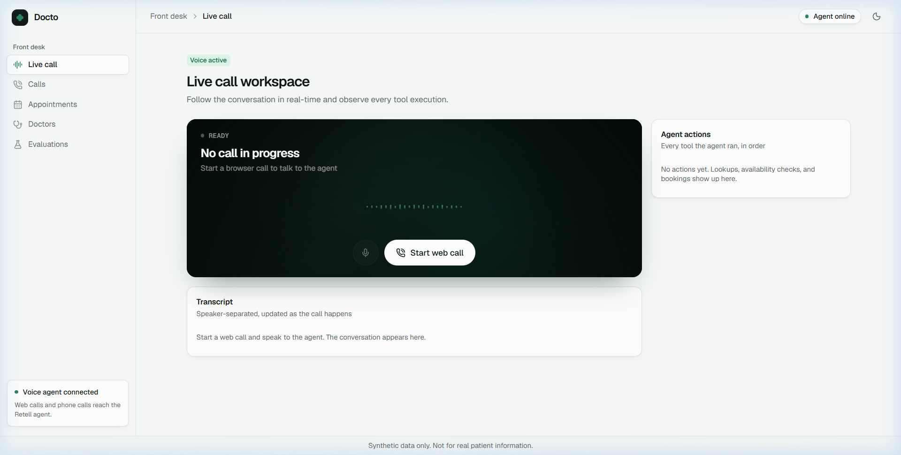

# Docto — AI Clinic Appointment Voice Agent

[](https://nextjs.org/)
[](https://www.typescriptlang.org/)
[](https://supabase.com/)
[](https://retellai.com/)
[](https://vitest.dev/)

Docto is an autonomous AI voice receptionist for clinical front desks. Powered by **Retell AI** (`gpt-6-luna`), PostgreSQL concurrency-safe exclusion constraints, and two-way Google Calendar synchronization, Docto handles patient lookup, availability checking, scheduling, rescheduling, and cancellations over phone and browser web calls in real time.

Live Deployment: [https://docto-agent.vercel.app](https://docto-agent.vercel.app)

---

## Application Preview



*The live front-desk workspace: real-time call stage, live transcript stream, tool execution audit trail, and clinic agenda.*

---

## Key Features

- **Conversational Voice Scheduling**: Real-time natural phone & browser audio calls powered by Retell AI with sub-second latency and interruption handling.
- **Race-Condition Proof Double-Booking Prevention**: PostgreSQL GiST exclusion constraints (`appointments_no_doctor_overlap`) enforce database-level slot locks across concurrent callers.
- **Strict Server-Derived Idempotency**: Cryptographic hashes of `call_id + patient_id + doctor_id + start_at` guarantee repeat tool calls never duplicate records.
- **Two-Way External Calendar Sync**: Non-blocking Google Calendar integration that records bookings locally immediately, then syncs external calendars with background retries.
- **Real-Time Operator Observability**: Interactive dashboard streaming live call transcripts, step-by-step tool invocations, upcoming appointments, and provider shifts.
- **Automated Tool Contract Eval Suite**: Benchmark test harness evaluating tool schemas, availability accuracy, and edge-case multi-turn scenarios.

---

## Architecture Overview

```text
                  ┌────────────────────────┐
                  │    Patient / Caller    │
                  └───────────┬────────────┘
                              │ Voice (WebRTC / Telephony)
                              ▼
                  ┌────────────────────────┐
                  │    Retell AI Voice     │
                  └───────────┬────────────┘
                              │ Signed HTTP Function Calls & Webhooks
                              ▼
                  ┌────────────────────────┐
                  │   Next.js API Engine   │
                  │   (/api/tools/*)       │
                  └─────┬────────────┬─────┘
                        │            │
       PostgreSQL DDL / │            │ Google Calendar API
       GiST Range Locks │            │ Free/Busy & Event Upsert
                        ▼            ▼
        ┌──────────────────┐      ┌──────────────────┐
        │ Supabase / PG    │      │ Google Calendar  │
        │ (Truth Source)   │      │ (External Sync)  │
        └──────────────────┘      └──────────────────┘
```

---

## Tech Stack

| Layer | Technologies |
|---|---|
| **Frontend & UI** | Next.js 16 (App Router), React 19, Tailwind CSS v4, Lucide Icons |
| **Backend API** | Next.js Route Handlers, Server Actions, Node.js crypto primitives |
| **Database** | PostgreSQL / Supabase, `postgres.js`, Drizzle ORM, `btree_gist` extension |
| **Voice AI** | Retell AI (`retell-client-js-sdk` v3, `retell-sdk`, `gpt-6-luna`) |
| **Integrations** | Google Calendar API (`google-auth-library` offline OAuth2) |
| **Testing** | Vitest (78 unit/integration tests with wire-protocol isolation) |

---

## Quick Start

### 1. Clone & Install

```bash
git clone https://github.com/Deekshith-j/Hello-Doc-voice-agent.git
cd Hello-Doc-voice-agent
npm install
```

### 2. Configure Environment

Copy `.env.example` to `.env.local`:

```bash
cp .env.example .env.local
```

Key environment variables:

```env
# Database (Supabase PostgreSQL pooled or direct URL)
DATABASE_URL=postgresql://postgres:[PASSWORD]@[HOST]:[PORT]/postgres

# Retell AI
RETELL_API_KEY=your_retell_api_key
RETELL_AGENT_ID=your_retell_agent_id
RETELL_LLM_ID=your_retell_llm_id

# Public URL (for registering Retell webhook & tool URLs)
PUBLIC_BASE_URL=https://docto-agent.vercel.app

# Optional Calendar Sync & Background Reconciliation
CRON_SECRET=your_random_32_character_secret
GOOGLE_CLIENT_ID=your_google_client_id
GOOGLE_CLIENT_SECRET=your_google_client_secret
GOOGLE_REFRESH_TOKEN=your_offline_refresh_token
```

### 3. Database Migrations & Seed

```bash
npm run db:migrate
npm run db:seed -- --target=main
```

### 4. Provision Retell Agent

To configure the LLM prompt, voice, and all 7 tool endpoints on Retell:

```bash
npm run retell:setup
```

### 5. Run Locally

```bash
npm run dev
```

Open [http://localhost:3000](http://localhost:3000) to view the Live Call workspace.

---

## Quality Verification

Run the verification suite:

```bash
# Typecheck TypeScript
npm run typecheck

# Lint (zero warnings allowed)
npm run lint

# Run all 78 unit & integration tests
npm test

# Run tool contract evaluation harness
npm run eval

# Production build verification
npm run build
```

---

## Known Limitations

- **Public Demo Environment**: The dashboard and Live Call workspace are open without login for demo purposes. Only synthetic seed records are exposed. Authentication must be enabled before connecting real patient data or protected health information (PHI).
- **Public Web Call Rate Limiting**: The browser web call endpoint (`/api/retell/web-call`) is rate limited to 5 calls per IP per hour and 30 calls daily overall to protect voice API quotas.
- **External Calendar Sync**: External Google Calendar updates rely on provider OAuth refresh tokens; local PostgreSQL records commit first as `pending` if Google Calendar is unavailable.
